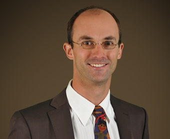
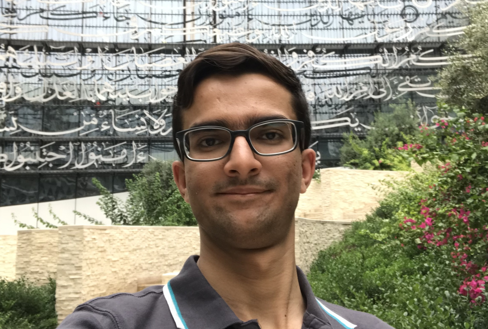
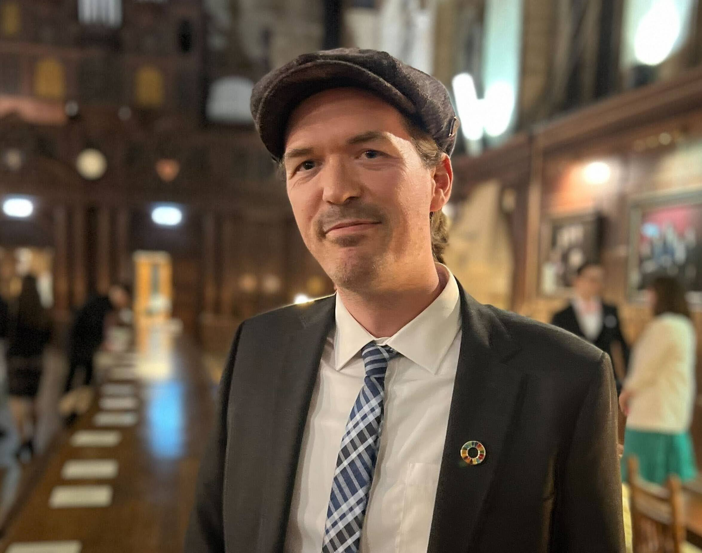
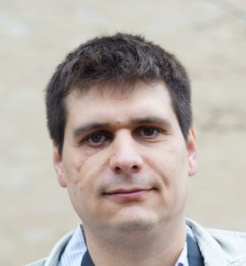
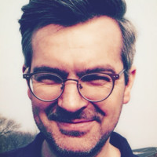
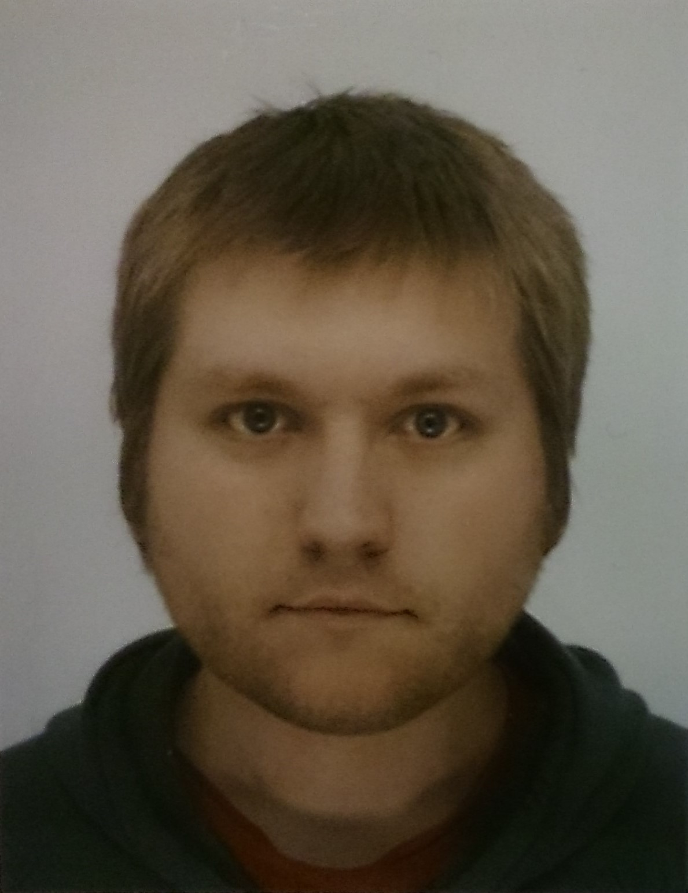

## Ridhi Kashyap
### Professor of Demography and Computational Social Science
  

Ridhi is professor of demography and computational social science at the University of Oxford and professorial fellow 
of Nuffield College. She is the Principal Investigator of the Digital Gender Gaps project. Her research spans different 
areas of demography and sociology. As a part of the Digital Gender Gaps project, she along with her collaborators are 
studying gender inequalities in internet and mobile use and their implications for other types of social inequalities. 
Her other research is on topics such as son preference, prenatal sex selection and gender gaps in health and mortality, 
and the effects of educational expansion on marriage and family change. Her methodological interests focus on how 
computational innovations both in terms of modelling approaches and digital data from web and social media platforms 
can be applied to study social and demographic phenomena. She is especially interested in how big data can be used to 
measure and monitor sustainable development goals.

**Academic Profile:** 
<a href="https://www.nuffield.ox.ac.uk/people/profiles/ridhi-kashyap/" target="_blank">Prof. Ridhi Kashyap</a>  
**Twitter:** 
<a href="ridhikash07" target="_blank">https://twitter.com/ridhikash07</a>  
**LinkdIn:** 
<a href="https://linkedin.com/in/ridhi-kashyap-88600b15b/" target="_blank">ridhi-kashyap</a>  

---

## Ingmar Weber
### Alexander von Humbolt Professor in Artificial Intelligence
  

Ingmar is the Alexander von Humboldt Professor in Artificial Intelligence at Saarland University. He was previously 
Research Director for Social Computing at the Qatar Computing Research Institute (QCRI). His interdisciplinary research 
looks at what online user-generated data can tell us about the offline world and society at large. He works with 
sociologists, political scientists, demographers and medical professionals to address topics ranging from digital 
gender gaps, to lifestyle diseases to improving population statistics. Prior to joining QCRI, Ingmar Weber was a 
researcher at Yahoo! Research Barcelona where he pioneered the use of Big Data to monitor international migration.

**Twitter:** 
<a href="https://twitter.com/ingmarweber" target="_blank">ingmarweber</a>  
**LinkdIn:** 
<a href="https://linkedin.com/in/ingmarweber" target="_blank">ingmarweber</a>  

---

## Massomali Fatehkia
### Research Assistant

Masoomali is a research assistant at the Social Computing group of the Qatar Computing Research Institute (QCRI). His 
research is focused on the use of social media advertising data to augment traditional statistical sources for 
monitoring development goals. His involvement with the Digital Gender Gaps project began in the summer of 2017 when he 
visited QCRI as part of Princeton University’s International InternshipsProgram. He completed his undergraduate studies 
at Princeton University in 2018 where he majored in Operations Research with certificates (minors) in Statistics & 
Machine Learning and Applications of Computing.

**Twitter:** 
<a href="https://twitter.com/MFatehkia" target="_blank">MFatehkia</a>  

---

## Doug Leasure
### Senior Researcher / Senior Data Scientist

Doug is a senior data scientist for the Leverhulme Centre for Demographic Science at the University
of Oxford. He is a member of the Department of Sociology and an affiliate member of Nuffield College. His research is 
focused on demographic estimation in data scarce contexts by developing Bayesian statistical methods to integrate novel 
data sources from remote sensing, geospatial information, and digital traces (such as social media activity) with 
traditional data from household surveys, census, and registry data. He has a PhD in Biological Sciences and 
post-doctoral research experience at WorldPop and the Odum School of Ecology.

**Academic Profile:** 
<a href="https://www.demographicscience.ox.ac.uk/douglas-leasure" target="_blank">Dr. Douglas Leasure</a>  
**GitHub:** 
<a href="https://github.com/doug-leasure" target="_blank">doug-leasure</a>

---

## Jiani Yan
### Research Assistant

Jiani is a DPhil student and research assistant in the Department of Sociology at the University of Oxford. She has a 
Master of Philosophy in Sociology and Demography from the University of Oxford and a Master of Science in Financial 
Economics from the University of Birmingham. Jiani works on a range of projects at the Leverhulme Centre for Demographic 
Science providing programming expertise for web scraping, automated data collection, server development, 
and data analysis.

**LinkdIn:** 
<a href="https://uk.linkedin.com/in/jiani-yan-728921194" target="_blank">jiani-yan</a>  
**GitHub:** 
<a href="https://github.com/vallerrr" target="_blank">vallerrr</a>

---

## Maksym Bondarenko
### Web Developer

Maksym is co-founder and director of 
<a href="https://www.gisrede.com/" target="_blank">GISRede</a>, 
and he leads the Spatial Data 
Infrastructure team of the WorldPop research group at the University of Southampton. He received an MSc in Applied 
Mathematics in 2002 and a Master’s degree in Software Development in 2004 from Kharkiv State University, Ukraine. He 
completed his PhD in Computational Mathematics (Fluid Dynamics), at the University of Southampton in 2008. During a 
research fellowship, he was in charge of managing the lifecycle of the High Energy Physics Model Database (HEPMDB) 
project. HEPMDB acts as a central storage, calculation and dissemination point for the data produced by High Energy 
Physics (HEP) tools. 

**Academic Profile:** 
<a href="https://www.southampton.ac.uk/geography/about/staff/mb4.page" target="_blank">Dr. Maksym Bondarenko</a>  
**GitHub:** 
<a href="https://github.com/GISRede" target="_blank">GISRede</a>

---

## David Kerr
### Web Developer

David is co-founder and director of 
<a href="https://www.gisrede.com/" target="_blank">GISRede</a>, and he is a senior geospatial analyst for 
the UK Office of National Statistics. He received a master's degree in Geographic Information Science and Cartography 
from the University of Leeds in 2018. He previously worked as a GIS application developer for the WorldPop research 
group at the University of Southampton.

**LinkdIn:** 
<a href="https://uk.linkedin.com/in/david-kerr-58a247120" target="_blank">david-kerr</a>  
**GitHub:** 
<a href="https://github.com/GISRede" target="_blank">GISRede</a>  

---

## Ian Knowles 
### Data Engineer
  

Ian was a data engineer for the Leverhulme Centre for Demographic Science at the University of Oxford. He 
has an academic background and wide-ranging experience in industry with development experience in most major languages. 
He has worked on projects that range from embedded device firmware and applications, to desktop and mobile applications, 
and on to full stack web server development and operations. He developed the prototype version of the website backend, 
frontend, and converted the visualisations to web formats.

**GitHub:** 
<a href="https://github.com/ianknowles" target="_blank">ianknowles</a>